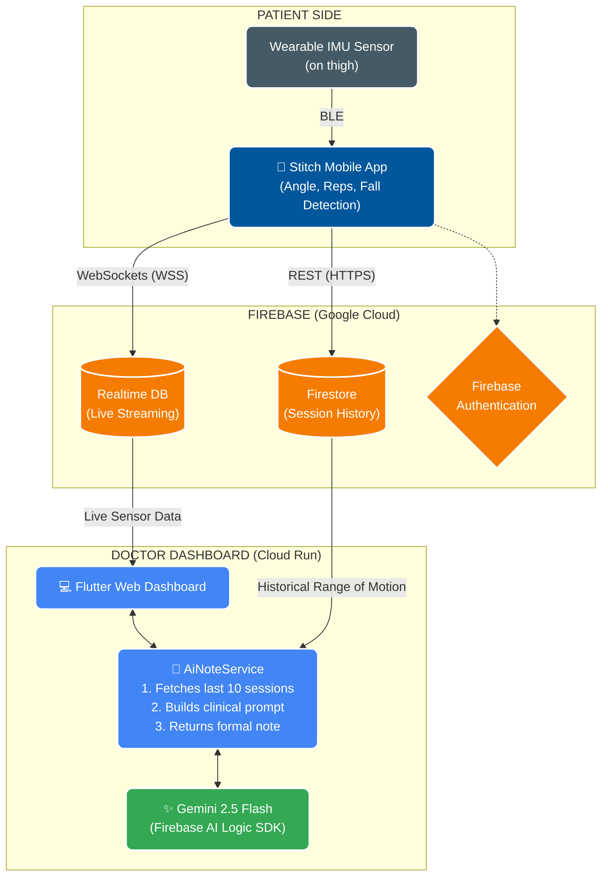

<!-- Replace the URL below with your actual project logo or banner image -->


# 🏥 TeleRehab — AI-Powered Remote Rehabilitation System

**Project 2030: MyAI Future Hackathon | Healthcare Track**

[](https://flutter.dev)
[](https://firebase.google.com)
[](https://ai.google.dev)
[](https://cloud.google.com/run)


> **A unified tele-rehabilitation system: a wearable sensor talking to a patient mobile app, bridged by Firebase, analysed by Gemini AI, and monitored live by a clinician web dashboard.**

---

## 📋 Table of Contents

1. [Overview & National Impact](#overview--national-impact)
2. [The Problem](#the-problem)
3. [Repository Structure](#repository-structure)
4. [Features & Agentic AI](#features--agentic-ai)
5. [Architecture Overview](#architecture-overview)
6. [Tech Stack](#tech-stack)
7. [Getting Started](#getting-started)
8. [Deployment](#deployment)
9. [AI Usage Disclosure](#ai-usage-disclosure)
10. [Team](#team)

---

## 🌏 Overview & National Impact

**TeleRehab** is a **unified, cross-platform tele-rehabilitation system** that bridges the gap between physiotherapists and patients in remote or underserved communities across Malaysia. The system consists of two interconnected Flutter applications backed by a shared Firebase project:

- **Stitch (Patient App)** — A mobile Flutter app. The patient straps a wearable IMU sensor to their thigh and performs exercises. The app connects to the sensor via BLE and streams live angle, rep, and fall detection data to the cloud.
- **Doctor Dashboard (Web App)** — A Flutter Web app deployed on Google Cloud Run. The clinician sees live sensor feeds and session histories, and can invoke an AI agent powered by **Gemini 2.5 Flash** to autonomously generate a formal clinical progress note.

This project directly supports Malaysia's **Twelfth Malaysia Plan (12MP)** goals, particularly the commitment to strengthening healthcare delivery in rural and underserved areas, and aligns with **MyDIGITAL** ambitions to leverage AI for public sector transformation. By reducing the dependency on in-person clinic visits, TeleRehab has the potential to scale physiotherapy services to millions of Malaysians who currently lack convenient access to specialist care.

---

## 🚨 The Problem

Malaysia's healthcare system faces a critical convergence of challenges in rehabilitation:

| Challenge | Impact |
|---|---|
| **Practitioner Shortage** | Fewer than 4 physiotherapists per 10,000 people in rural Malaysia |
| **Logistical Barriers** | Long travel distances make frequent clinic visits unfeasible |
| **Unreliable Self-Reporting** | Patients subjectively over-report or under-report exercise compliance |
| **Real-Time Feedback Latency** | Corrections to poor form or dangerous technique are delayed until the next appointment |
| **Cognitive Accessibility** | Elderly or low-literacy patients struggle with complex app interfaces |
| **Technology Abandonment** | 60%+ of digital health apps are abandoned within 30 days due to poor UX |

TeleRehab addresses each of these pain points with a hardware-software-AI solution that is objective, accessible, and clinically actionable.

---

## ✨ Features & Agentic AI

TeleRehab goes far beyond a simple data dashboard. It implements **Agentic AI** — where the Gemini model autonomously reasons over multiple data sources, makes clinical judgements, and produces structured recommendations without human prompting.

### Core Features

- **📡 Real-Time Sensor Streaming**
  - Wearable thigh sensor streams live angle, rep count, and fall-detection data via Bluetooth Low Energy (BLE) to the patient's mobile device.
  - Data is pushed to Firebase Realtime Database and displayed live on the doctor's dashboard.

- **📊 Session Recording & History**
  - Every rehabilitation session is automatically stored in Firestore (`session_history`) with timestamped metrics: pass/fail reps, duration, angle range, and fall probability.

- **🤖 Agentic AI — Autonomous Clinical Note Generation**
  - Powered by **Gemini 2.5 Flash**, the AI agent autonomously:
    1. **Retrieves** the patient's last 10 sessions from Firestore (multi-session reasoning).
    2. **Analyses** movement speed, success rates, angle range anomalies, and fall events.
    3. **Cross-references** against clinical thresholds (e.g., `>120°` angle flags sensor anomaly).
    4. **Generates** a formal, third-person clinical progress note in one step, without any manual input from the doctor.
  - This is agentic because the model is given **tools (data retrieval)**, a **goal (write a note)**, and a **domain ruleset (clinical guidelines)** — and acts independently to fulfil it.

- **⚠️ Intelligent Fall Detection Prioritisation**
  - If a fall event is captured, the AI **overrides its default note structure** and leads with the fall incident, potential causes, and an urgent recommendation for physical assessment. This demonstrates autonomous priority reasoning.

- **🔐 Secure, Role-Based Access & Judge Demo**
  - Firebase Authentication restricts data access to authorised practitioners.
  - *Hackathon Note:* A "One-Click Demo Access" button has been embedded in the login portal to allow judging panels instant access to the dashboard without requiring credentials.

- **🎨 Clinician-Optimised UI**
  - Glassmorphism-themed Flutter dashboard with animated backgrounds and clear data cards.
  - Session history timeline with exercise-specific icons for instant recognition.

---

## 📁 Repository Structure

This is a **monorepo** — both the patient-facing mobile app and the clinician-facing web dashboard share this single repository and the same Firebase project (`telerehab-a420e`).

```
doctor_dashboard/          ← Root repository
├── lib/                   ← Doctor Dashboard source (Flutter Web)
│   ├── screens/           ← Dashboard, Login screens
│   ├── services/          ← AiNoteService, Firebase listeners
│   └── main.dart          ← Web app entry point (with Auth Gate)
├── stitch_app/            ← Patient Mobile App (Flutter Android/iOS)
│   ├── lib/
│   │   ├── screens/       ← Home, Exercises, per-exercise screens
│   │   ├── services/      ← FirebaseService (RTDB + Firestore dual-write)
│   │   │                     BleService, FallDetectionService
│   │   └── main.dart      ← Mobile app entry point (anonymous auth)
│   └── pubspec.yaml
├── firestore.rules        ← Shared Firestore security rules
├── database.rules.json    ← Shared Realtime DB security rules
├── firestore.indexes.json ← Composite indexes for AI query
├── firebase.json          ← Firebase project configuration
└── README.md
```

---

## 🏗️ Architecture Overview



**Key Architectural Decisions:**
- **WebSockets via Firebase Realtime Database:** We maintain persistent WebSocket (WSS) connections to enable true, sub-second live streaming of IMU sensor data. This bypasses the overhead of HTTP polling for zero-refresh UI updates.
- **REST via Cloud Firestore:** Used for historical session records (optimised for structured queries, batched writes, and composite indexes).
- **Firebase AI Logic SDK** (`firebase_ai` package) is used to call Gemini, ensuring the API key is managed server-side and never exposed in client code.
- The doctor dashboard is a **Flutter Web** application deployed as a stateless container on **Google Cloud Run**, enabling auto-scaling to zero cost.

---

## 🛠️ Tech Stack

| Layer | Technology | Purpose |
|---|---|---|
| **AI Model** | Gemini 2.5 Flash | Autonomous clinical note generation |
| **AI SDK** | Firebase AI Logic (`firebase_ai`) | Secure server-side Gemini API access |
| **Mobile App** | Flutter (Dart) | Patient-facing exercise app with BLE |
| **Doctor Dashboard** | Flutter Web (Dart) | Clinician-facing monitoring portal |
| **Live Database** | Firebase Realtime Database | Sub-second sensor data streaming |
| **Historical DB** | Cloud Firestore | Session history, structured queries |
| **Auth** | Firebase Authentication | Role-based access control |
| **Deployment** | Google Cloud Run | Serverless, scalable web hosting |
| **Hardware** | Custom IMU/BLE Sensor | Wearable thigh angle & fall detection |

---

## 🚀 Getting Started

### Prerequisites

Ensure you have the following installed:

```bash
# Flutter SDK (3.x or higher)
flutter --version

# Firebase CLI
firebase --version

# FlutterFire CLI (for Firebase configuration)
dart pub global activate flutterfire_cli
```

### 1. Clone the Repository

```bash
git clone https://github.com/kkwanengineering-png/doctor_dashboard.git
cd doctor_dashboard
```

### 2. Configure Firebase (Mobile Setup)

> 💡 **Hackathon Deployment Note:** The `lib/firebase_options.dart` file has been **deliberately committed** to this repository. This allows Google Cloud Run to successfully execute the Docker web build straight from GitHub without missing configuration. Web API keys are strictly restricted via Firebase Security Rules.

If you are developing the **Mobile App (Stitch)**, you still need to generate the local Android/iOS configuration since those are excluded:

```bash
# Log in to Firebase
firebase login

# Configure Firebase for this project
flutterfire configure --project=telerehab-a420e
```

This will generate:
- `android/app/google-services.json`
- `ios/Runner/GoogleService-Info.plist`

Repeat for the Patient App:

```bash
cd stitch_app
flutterfire configure --project=telerehab-a420e
```

### 3. Install Flutter Dependencies

**Doctor Dashboard (Web):**
```bash
# From the root directory
flutter pub get
```

**Patient App (Mobile):**
```bash
cd stitch_app
flutter pub get
```

### 4. Run the Apps

```bash
# Doctor Dashboard — run as Flutter Web app
flutter run -d chrome

# Patient App — run on a connected Android/iOS device or emulator
cd stitch_app
flutter run
```

### 5. Deploy Firebase Security Rules & Indexes

```bash
# Deploy Firestore security rules and indexes
firebase deploy --only firestore

# Deploy Realtime Database rules
firebase deploy --only database
```

---

## ☁️ Deployment

The Doctor Dashboard (Flutter Web) is deployed as a containerised application on **Google Cloud Run**:

- **Build**: `flutter build web --release`
- **Containerise**: A `Dockerfile` packages the compiled web output into an NGINX container.
- **Deploy**: The container image is pushed to Google Artifact Registry and deployed to Cloud Run, which provides:
  - **Auto-scaling** from zero to handle any number of concurrent clinicians.
  - **HTTPS by default** with a managed TLS certificate.
  - **Pay-per-use pricing**, making it cost-effective for a healthcare startup.

```bash
# Deploy directly from source using Google Cloud Build
# This will automatically build the Dockerfile and deploy to Cloud Run
gcloud run deploy telerehab-dashboard \
  --source . \
  --platform managed \
  --region asia-southeast1 \
  --allow-unauthenticated \
  --port 8080
```

---

## 🤖 AI Usage Disclosure

In the spirit of full transparency and in compliance with the **Project 2030: MyAI Future Hackathon** ethics guidelines, we disclose the following AI tools used during the development of this project:

| AI Tool | Version | Usage |
|---|---|---|
| **Antigravity (powered by Gemini)** | Flash | Used as an AI coding assistant within the IDE to accelerate code generation, debug issues, refactor components (e.g., Auth Gate, Login Screen, Security Rules), and write documentation. |
| **Google Gemini** | 2.5 Pro | Used for architectural planning, code review, and generating boilerplate for complex Flutter widgets. |
| **Gemini 2.5 Flash** | (via Firebase AI Logic) | The production AI model embedded **within the application** to autonomously generate clinical progress notes from session data. |

> **Important Distinction:** Gemini Flash is not only a development tool — it is the **core product feature**, functioning as an embedded clinical AI agent within the application.
>
> All final code, architecture decisions, clinical prompt engineering, and system integration were reviewed, tested, and validated by the human development team. AI-generated code was never blindly committed without verification.

---

## 👥 Team

- Lee Kwan Huai
- Nicholas Foo Han Wen
- Desmond Tan Kai Lok
- Wong Kar Ming

**Track:** Healthcare
**Hackathon:** Project 2030: MyAI Future Hackathon, Malaysia

---

Built with ❤️ for a healthier, more connected Malaysia.

*Empowering physiotherapists. Reaching every patient.*
